# Jara Pharmacy — Web App (Prompt 1)

A modern, premium, **bilingual (Albanian / English)** web app for **Jara Pharmacy** —
a pharmacy, health, beauty & wellness brand in **Prizren, Kosovo**.

Built as an inquiry-first product experience: browse categories, discover
products, find locations, and reach the pharmacy in one tap via WhatsApp, phone
or the contact form. Products with a price can also be bought online (card via
Raiffeisen RaiAccept, or cash on delivery/pickup); everything else routes into
the smart inquiry flow. See [docs/online-payment.md](docs/online-payment.md).

> **Cilësi. Besim. Kujdes.** — Quality. Trust. Care.

## Tech stack

- **React 18 + TypeScript + Vite** — fast, modern build tooling
- **Tailwind CSS** — design-token-driven, mobile-first styling
- **Framer Motion** — restrained, accessible micro-interactions
- **Lucide React** — consistent, tree-shakeable SVG icons
- **react-hook-form + zod** — validated contact/inquiry form

## Getting started

```bash
npm install      # install dependencies
npm run dev      # start the dev server (http://localhost:5173)
npm run build    # type-check + production build to /dist
npm run preview  # preview the production build
npm run lint     # type-check only (tsc --noEmit)
```

Requires Node 18+.

## Project structure

```
src/
  App.tsx                 # composition of providers + sections
  main.tsx                # entry point
  components/
    ui/                   # design-system primitives (Button, Modal, BrandLogo, ProductVisual…)
    navigation/           # Navbar + mobile drawer
    products/             # ProductCard, ProductModal, FilterBar
    layout/               # Footer
    common/               # FloatingWhatsApp, SkipLink
  sections/               # page sections (Hero, Trust, Categories, Products…)
  data/                   # typed content: products, categories, locations, copy (AL/EN)…
  context/                # I18nContext (locale) + InquiryContext (smart inquiry flow)
  hooks/                  # useReducedMotion, useScrolled, useCountUp, useActiveSection…
  lib/                    # cn, links (WhatsApp/Maps/tel/mailto), motion presets, accents
  types/                  # shared TypeScript models (+ shop.ts for orders)
  styles/global.css       # Tailwind layers, tokens, reduced-motion baseline
api/                      # Vercel serverless functions: orders, payment webhook, mock bank
  _lib/                   # db (Neon), RaiAccept client, mail (Resend), order logic
db/schema.sql             # Postgres tables for orders
vite/api-dev.ts           # serves api/ inside `npm run dev` (no Vercel login needed)
public/                   # favicon.svg, logo-mark.svg, logo-full.svg, og-image.svg
reference/                # original brand screenshots + research dossier (source of truth)
```

## Brand assets & imagery

- **Logo** — the original file was not supplied, so the interlinked rounded
  pharmacy cross was **recreated as scalable SVG**. It lives as a reusable React
  component (`components/ui/BrandLogo.tsx`, with `full` / `mark` / `footer`
  variants) plus static exports in `public/`: `favicon.svg`, `logo-mark.svg`,
  `logo-full.svg`, and a share image `og-image.svg`.
- **Product imagery** — original packshots were not provided. Rather than dumping
  screenshots into the layout, `components/ui/ProductVisual.tsx` generates
  **premium, brand-consistent gradient "studio" scenes** derived from each
  product's `form` + `palette` (rose for skincare, green for haircare, etc.),
  echoing the reference posts' color logic.
- The original screenshots and research dossier are preserved in `reference/`.

## Bilingual content

All visible UI copy lives in one place: **`src/data/copy.ts`**, keyed by locale
(`al` / `en`). English is typed against the Albanian shape so keys can never
drift. Bilingual content fields (products, categories, blog…) use a
`{ al, en }` shape resolved through `useI18n().tr()`. Albanian is the default.
Language is switched from the navbar/footer toggle and persisted to
`localStorage`; `<html lang>` updates accordingly.

## Smart inquiry flow

Clicking **“Pyet për këtë produkt” / “Ask about this product”**, opening a
product, or messaging from a card/modal routes the selected product into the
contact flow via `InquiryContext`:

- the contact form's **Product / Interest** field auto-fills,
- the WhatsApp message is pre-filled with the product name,
- the page smoothly scrolls to the contact section.

## Accessibility & SEO

- WAI-ARIA dialog pattern for the product modal: `role="dialog"`, `aria-modal`,
  focus trap, Escape to close, focus restored to the trigger, background locked.
- Semantic landmarks, skip-to-content link, visible focus rings, labelled
  icon-only buttons, comfortable touch targets, `prefers-reduced-motion` honored
  globally (CSS) and per-component.
- SEO: Albanian-first title/description, Open Graph + Twitter tags, canonical
  URL, and `Pharmacy` JSON-LD structured data generated from `src/data` at
  build time (`vite/seo/`). Every route in `src/lib/routes.ts` gets its own
  static HTML file and its own content in the app too: `/barnatore-ne-prizren`
  and `/lokacionet/<id>` open on `sections/RouteHero.tsx` (branch details,
  nearby branches, FAQ from `src/data/seoPages.ts`) instead of the homepage
  hero, so a crawler that renders JavaScript sees nineteen different pages.

## Delivery timeline

```mermaid
gantt
    title Jara Pharmacy — Prompt 1 Delivery
    dateFormat  X
    axisFormat  %s
    section Foundation
    Tooling & design tokens      :done, f1, 0, 1
    Brand SVG logo + assets      :done, f2, 1, 2
    section Content
    Types & bilingual data layer :done, c1, 2, 3
    lib · hooks · context        :done, c2, 3, 4
    section Interface
    UI primitives                :done, u1, 4, 5
    Section components           :done, u2, 5, 8
    section Ship
    Assemble app · SEO · a11y    :done, s1, 8, 9
    Build & verify               :active, s2, 9, 10
```



## Shop (online orders)

- **Prices** live in `src/data/prices.ts`; a product is buyable exactly when it
  has an entry there. Delivery methods and fees are in `src/data/shipping.ts`.
- **Cart** (`context/CartContext.tsx`) persists in localStorage; the drawer is
  `components/shop/CartDrawer.tsx`. Checkout is `/porosia`, an order's status
  page `/porosia/<id>` (both `noindex`); terms/privacy/delivery pages are
  `/info/<slug>` from `src/data/legal.ts` and are built as static HTML.
- **Server**: `api/orders` recomputes every amount from the price list, stores
  the order in Neon Postgres and, for card payments, creates a RaiAccept
  checkout session. `api/payments/raiaccept` is the webhook; the order page
  also re-checks with the gateway itself. `RAIACCEPT_MODE=mock` swaps the
  bank for a local test page so the whole flow runs offline.
- Environment variables: see `.env.example`. Bank onboarding, go-live
  checklist and the RaiAccept reference: [docs/online-payment.md](docs/online-payment.md).

## Extending later (CMS-ready)

Content models in `src/data` are shaped for a future backend/CMS: add locations
or products without refactoring, and swap the resilient search-based Google
Maps links for exact per-branch URLs.

---

© Jara Pharmacy · Rr. William Vokeri, Prizren, Kosovo, 20000
